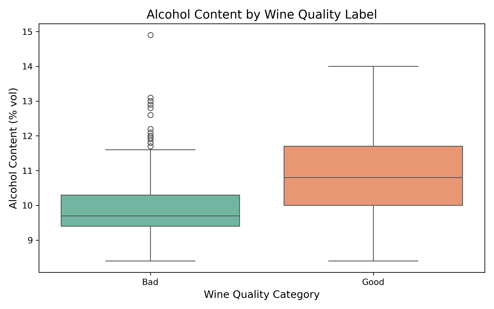
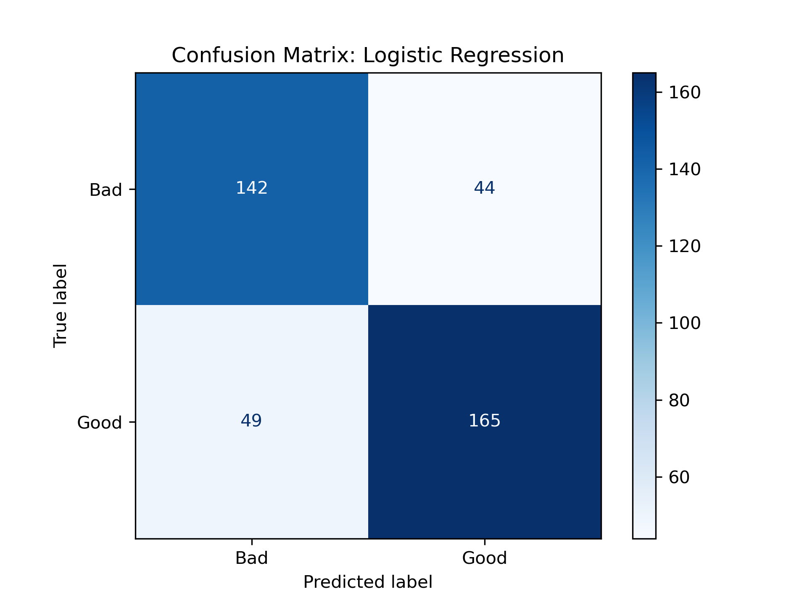

```{python}
import pandas as pd

summary = pd.read_csv("results/report_summary.csv").iloc[0]
metrics_tbl = pd.read_csv("results/model_metrics.csv")
metrics_tbl["support"] = metrics_tbl["support"].astype(int)

good_metrics = metrics_tbl.loc[metrics_tbl["class"] == "Good"].iloc[0]
bad_metrics = metrics_tbl.loc[metrics_tbl["class"] == "Bad"].iloc[0]

accuracy = float(summary["accuracy"])
good_precision = float(good_metrics["precision"])
good_recall = float(good_metrics["recall"])
good_f1 = float(good_metrics["f1_score"])
bad_precision = float(bad_metrics["precision"])
bad_recall = float(bad_metrics["recall"])
bad_f1 = float(bad_metrics["f1_score"])
```

## Summary

This project aims to build a classification model to predict whether a red wine is of "Good" quality (a score of 6 or higher) or "Bad" quality based on its objective physicochemical tests (such as alcohol content, acidity, and residual sugar) using the **Red Wine Quality Dataset** from the UCI Machine Learning Repository [@uciwinequality; @cortez2009modeling]. Using `{python} int(summary["n_rows"])` red wine observations, we performed exploratory data analysis and trained a basic classification model.

Our analysis indicates that chemical properties, particularly alcohol content, play a significant role in determining wine quality. High-level interpretation of our model's performance suggests that objective chemical testing can effectively supplement subjective human sensory evaluations. In a real-world context, these predictive insights could help winemakers adjust fermentation processes to improve quality or assist distributors in automating baseline quality control before sending wines to expert sommeliers.

## Introduction

### Background

Wine certification and quality assessment are crucial elements in the wine industry, traditionally relying heavily on human sensory evaluations by wine experts (sommeliers). However, human taste can be subjective. The objective physicochemical properties of wine, such as its acidity, residual sugar, chlorides, and alcohol content, are the fundamental chemical building blocks that determine its final taste and quality. Understanding the relationship between these chemical components and the perceived quality can help automate quality control and provide actionable insights for winemakers [@cortez2009modeling].

### Predictive Question

In this project, we ask the following predictive question: **Can we accurately predict whether a red wine will be classified as "Good" (having a sensory quality score of 6 or higher) based purely on its objective physicochemical properties?**

To answer this question, we are using the **Red Wine Quality Dataset** sourced from the UCI Machine Learning Repository [@uciwinequality]. This dataset contains `{python} int(summary["n_rows"])` instances of red *vinho verde* wine samples from the north of Portugal. Since we are framing this as a classification problem, we wrangle the 0-10 quality score into a binary target variable, with "Good" for scores >= 6 and "Bad" for scores < 6.

## Methods and Results

### Reproducible Data Download and Wrangling

To ensure our analysis is fully reproducible, we bypass manual downloads and use Python to fetch the raw data directly from the UCI Machine Learning Repository. Once downloaded, we save the raw dataset into our local `data/` directory.

After acquiring the data, we perform data wrangling to frame our predictive question as a classification task. The original dataset scores wine quality on a scale from 0 to 10. We engineer a new categorical feature, `label`, where wines scoring 6 or higher are classified as "Good", and those scoring strictly less than 6 are classified as "Bad". In the processed data, `{python} int(summary["good_count"])` wines are labeled as good and `{python} int(summary["bad_count"])` are labeled as bad.

### Exploratory Data Analysis

We visualize the distribution of alcohol content across "Good" and "Bad" wines. We use a boxplot to compare the groups, which effectively shows the median and spread while avoiding the overplotting issues common in large scatter plots. As shown in @fig-alcohol-boxplot, wines labeled as "Good" generally show higher alcohol content than wines labeled as "Bad" [@waskom2021seaborn].

{#fig-alcohol-boxplot width=70%}

### Predictive Modeling: Logistic Regression

We use a Logistic Regression model to predict the wine quality label [@pedregosa2011scikitlearn]. We split the data into 75% training and 25% testing sets. After training, we evaluate the model using class-specific metrics and a confusion matrix.

```{python}
#| label: tbl-model-metrics
#| tbl-cap: "Classification performance metrics for the logistic regression model on the test set."
metrics_tbl.round(2)
```

As shown in @tbl-model-metrics, the model achieved an overall accuracy of `{python} f"{accuracy:.2f}"` on the test set.

The model also showed balanced performance across both categories:

- For "Good" wines, it achieved a precision of `{python} f"{good_precision:.2f}"` and a recall of `{python} f"{good_recall:.2f}"`.
- For "Bad" wines, it achieved a precision of `{python} f"{bad_precision:.2f}"` and a recall of `{python} f"{bad_recall:.2f}"`.

The confusion matrix in @fig-confusion-matrix confirms that the model is effective at distinguishing quality, with `{python} int(summary["good_correct"])` "Good" wines and `{python} int(summary["bad_correct"])` "Bad" wines correctly classified.

{#fig-confusion-matrix width=65%}

## Discussion

### Summary of Findings

In this analysis, we investigated whether objective physicochemical properties could accurately predict the sensory quality of red wine. Our Logistic Regression model performed well, achieving an overall accuracy of `{python} f"{accuracy:.2f}"` on the test set.

Specifically, the model showed balanced performance across both categories:

- For "Good" wines, it achieved a precision of `{python} f"{good_precision:.2f}"` and a recall of `{python} f"{good_recall:.2f}"`.
- For "Bad" wines, it achieved a precision of `{python} f"{bad_precision:.2f}"` and a recall of `{python} f"{bad_recall:.2f}"`.

The confusion matrix shown in @fig-confusion-matrix confirms that the model is effective at distinguishing quality, while the exploratory data analysis in @fig-alcohol-boxplot highlighted that alcohol content is a strong differentiator, with "Good" wines generally showing higher median alcohol levels.

### Expectations vs. Results

The results exceeded our initial expectations, improving from earlier iterations by focusing strictly on the red wine subset. The high F1-scores of `{python} f"{good_f1:.2f}"` for Good wines and `{python} f"{bad_f1:.2f}"` for Bad wines indicate that chemical properties are indeed robust predictors of sensory quality. However, the remaining error rate suggests that taste is not 100% determined by these 11 chemical features alone; subtle factors like tannins, aromatic compounds, or the specific vineyard's terroir likely account for the rest of the variance.

### Impact and Future Questions

An accuracy of `{python} f"{accuracy:.2f}"` suggests that this model could be practically implemented as a preliminary automated sommelier tool. It could help wineries flag low-quality batches instantly during the production process, saving time and resources.

Future questions to explore include:

1. Would a non-linear model, such as a Random Forest, further improve the `{python} f"{accuracy:.2f}"` accuracy?
2. Which specific chemical feature (for example, volatile acidity versus alcohol) has the absolute highest predictive power?
3. How would the model perform if trained on wines from a different geographic region, such as California or France?

## References {.unnumbered}

::: {#refs}
:::
